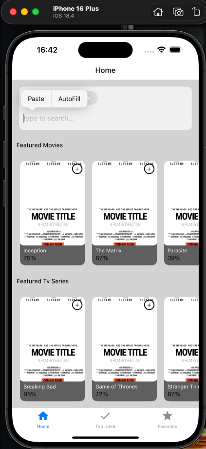
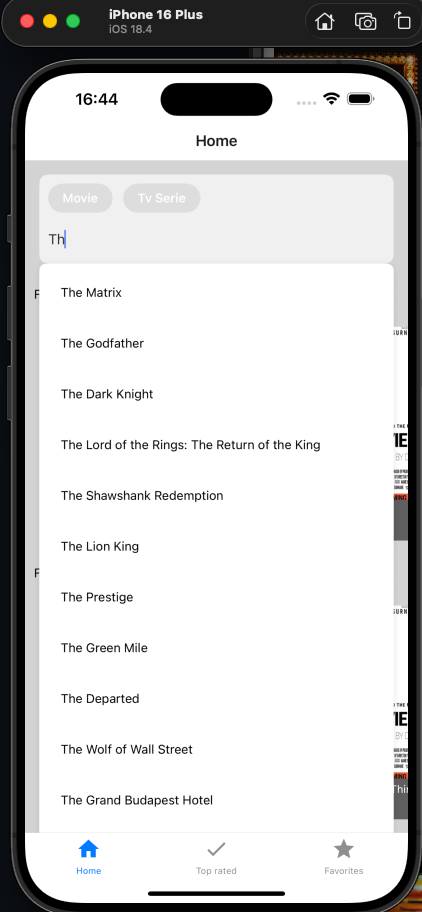
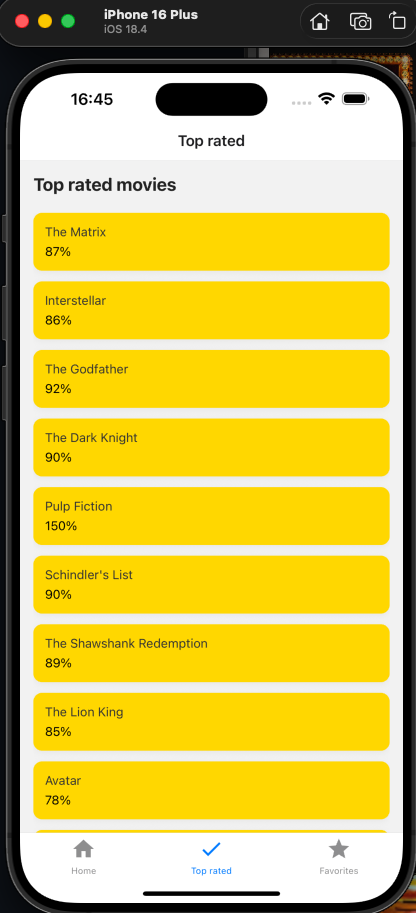
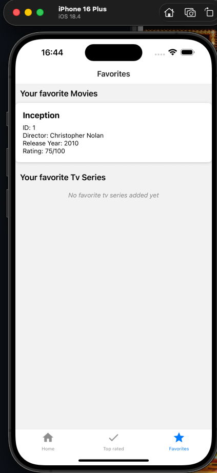

# React Native Movie Library

This project is a React Native Movie Library that provides a simple, fast interface for exploring movies and TV series. It uses a modular architecture with app for UI and features, domain for core models and logic, and server for a local mock API and dataset. The codebase emphasizes composable components (poster, loader, rating, list) and repository patterns (infrastructure/repositories) so you can swap data sources or add real APIs easily.

## Setup

### Global Setup

- Android setup if you want to develop on android ([link](https://docs.expo.dev/workflow/android-studio-emulator/))
- iOS setup if you want to develop on iOS: ([link](https://docs.expo.dev/workflow/ios-simulator/))
- Install node and package manager (npm) e.g. using corepack ([link](https://github.com/nodejs/corepack))

### Project Setup

- Install the packages/dependencies
- Start the server with `npm run start:server`
- Add execution rights to the script `chmod +x ./scripts/local-ip.sh`. (this script is used to resolve the local IP address such that the frontend can connect to the backend)
- Start the app with `npm start` and then select either `a` for android, `i` for ios, `w` for web. (Note: There will be an error. Fixing this is the first task)

## Key Features

- Browse: Featured lists and top-rated views for movies and TV series.
- Search: Fast full-text search across the catalog.
- Favorites: Save and view favorite items per user.
- Modular UI: Reusable components like poster, rating, loader, and icon button.
- Mock Server: Built-in mock server and JSON data for quick local development.
- Clean Architecture: Domain models and repository layer separate UI from data sources.

## Screenshots

### Home Page

### Search

### Rating

### Favorites

